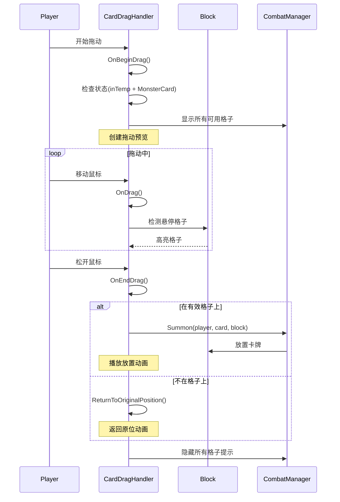

# 卡牌拖动系统使用文档

## 📋 功能特性

### 核心功能
- ✅ 拖动卡牌到格子（替代点击操作）
- ✅ 实时检测有效投放目标
- ✅ 拖动预览效果
- ✅ 格子高亮提示
- ✅ 自动返回原位
- ✅ 支持点击/拖动双模式

### 视觉反馈
- **拖动开始**: 卡牌放大 + 半透明 + 显示预览
- **拖动中**: 跟随鼠标 + 检测目标格子
- **悬停格子**: 格子放大 + 变绿色
- **放置成功**: 卡牌移动到格子
- **放置失败**: 平滑返回原位

---

## 🎯 与点击模式的对比

| 特性 | 点击模式 | 拖动模式 |
|------|---------|---------|
| 操作流程 | 点卡牌 → 点格子 | 拖卡牌 → 放到格子 |
| 可见性 | 需显示所有格子 | 只在拖动时显示 |
| 精准度 | 低（两步操作） | 高（一步到位） |
| 取消操作 | 需点其他地方 | 松开鼠标即可 |
| 视觉反馈 | 静态高亮 | 动态跟随 |
| 用户体验 | 传统 | 现代、直观 |

---

## 🛠️ 快速开始

### Step 1: 添加拖动组件

拖动功能会自动添加到 `BattleCard` 上，无需手动操作。

在卡牌预制体上：
```
CardPrefab
├── BattleCard (设置 Interaction Mode = Drag)
├── CardDragHandler (自动添加)
├── CardDisplay
└── CanvasGroup
```

### Step 2: 配置拖动参数

在 `CardDragHandler` 组件中：

```
Drag Settings:
├─ Can Drag: true              // 是否可拖动
├─ Drag Scale: 1.2             // 拖动时缩放
└─ Return Duration: 0.3        // 返回原位时长

Visual Feedback:
├─ Show Drag Preview: true     // 显示拖动预览
├─ Drag Tint Color: (1,1,1,0.8)// 拖动时颜色
└─ Hover Scale: 1.1            // 悬停时缩放
```

### Step 3: 在 CardPanel 中启用拖动

```csharp
[SerializeField] private CardPanel cardPanel;

void Start()
{
    // 设置为拖动模式
    cardPanel.SetCardInteractionMode(CardInteractionMode.Drag);
}
```

---

## 📖 API 使用

### BattleCard

```csharp
BattleCard battleCard = GetComponent<BattleCard>();

// 设置交互模式
battleCard.SetInteractionMode(CardInteractionMode.Drag);  // 拖动模式
battleCard.SetInteractionMode(CardInteractionMode.Click); // 点击模式

// 获取当前模式
CardInteractionMode mode = battleCard.GetInteractionMode();
```

### CardDragHandler

```csharp
CardDragHandler dragHandler = cardObject.GetComponent<CardDragHandler>();

// 设置是否可拖动
dragHandler.SetDraggable(true);

// 检查是否正在拖动
bool dragging = dragHandler.IsDragging;

// 订阅事件
dragHandler.OnDragStart += (card) => {
    Debug.Log("开始拖动");
};

dragHandler.OnDragEnd += (card) => {
    Debug.Log("结束拖动");
};

dragHandler.OnDropOnBlock += (card, block) => {
    Debug.Log($"卡牌放置到格子");
};
```

### CardPanel

```csharp
CardPanel panel = GetComponent<CardPanel>();

// 设置所有卡牌的交互模式
panel.SetCardInteractionMode(CardInteractionMode.Drag);

// 添加卡牌时会自动应用当前模式
panel.AddCard(cardPrefab, animated: true);
```

---

## 🔄 拖动流程详解



---

## 🎨 视觉效果详解

### 1. 拖动开始动画

```csharp
// 放大卡牌
transform.DOScale(dragScale, 0.2f);

// 半透明
canvasGroup.DOFade(0.8f, 0.2f);

// 提升层级
transform.SetAsLastSibling();
```

### 2. 格子高亮动画

```csharp
// 普通状态：循环脉动
block.SummonBlock.transform.DOScale(1.1f, 0.3f)
    .SetLoops(-1, LoopType.Yoyo);

// 悬停状态：放大 + 变绿
block.SummonBlock.transform.DOScale(1.3f, 0.2f);
image.DOColor(Color.green, 0.2f);
```

### 3. 返回原位动画

```csharp
Sequence returnSeq = DOTween.Sequence();
returnSeq.Append(rectTransform.DOAnchorPos(originalPosition, 0.3f));
returnSeq.Join(transform.DOScale(1f, 0.3f));
returnSeq.Join(canvasGroup.DOFade(1f, 0.3f));
```

---

## 🔗 与 CombatManager 集成

### 自动集成

拖动功能已自动集成到现有战斗系统：

1. **检测卡牌状态**
   ```csharp
   if (battleCard.state != BattleCardState.inTemp)
       return; // 只有临时区域的卡可拖
   ```

2. **检测卡牌类型**
   ```csharp
   if (!(display.card is MonsterCard))
       return; // 只有怪物卡可召唤
   ```

3. **调用召唤方法**
   ```csharp
   CombatManager.Instance.Summon(
       battleCard.playerOwner,
       gameObject,
       block.transform
   );
   ```

### 完整示例：战斗UI管理器

```csharp
public class BattleUIManager : MonoBehaviour
{
    [SerializeField] private CardPanel temporaryCardPanel;
    [SerializeField] private CardPanel playerHandPanel;
    
    void Start()
    {
        // 临时区域使用拖动模式
        temporaryCardPanel.SetCardInteractionMode(CardInteractionMode.Drag);
        
        // 手牌区可以使用点击模式
        playerHandPanel.SetCardInteractionMode(CardInteractionMode.Click);
    }
    
    // 从对手抽卡到临时区域
    public void OnDrawFromOpponent(List<Card> drawnCards)
    {
        temporaryCardPanel.ClearCards(false);
        
        foreach (var card in drawnCards)
        {
            GameObject cardObj = CreateCardObject(card);
            temporaryCardPanel.AddCard(cardObj, true);
        }
        
        temporaryCardPanel.Show();
    }
    
    private GameObject CreateCardObject(Card card)
    {
        GameObject cardObj = Instantiate(cardPrefab);
        
        // 设置显示
        var display = cardObj.GetComponent<CardDisplay>();
        display.card = card;
        display.UpdateCardDisplay();
        
        // 设置战斗卡
        var battleCard = cardObj.GetComponent<BattleCard>();
        battleCard.playerOwner = card.owner;
        battleCard.state = BattleCardState.inTemp;
        
        return cardObj;
    }
}
```

---

## ⚙️ 高级定制

### 自定义拖动判定

```csharp
public class CustomCardDragHandler : CardDragHandler
{
    protected override bool CanStartDrag()
    {
        // 自定义拖动条件
        BattleCard battleCard = GetComponent<BattleCard>();
        
        // 例如：只有特定系列的卡可拖动
        CardDisplay display = GetComponent<CardDisplay>();
        if (display.card.series != CardSeries.Memory)
            return false;
        
        return base.CanStartDrag();
    }
}
```

### 自定义放置效果

```csharp
dragHandler.OnDropOnBlock += (card, block) => {
    // 播放特效
    PlayDropEffect(block.transform.position);
    
    // 播放音效
    AudioManager.Instance.PlaySound("card_drop");
    
    // 震动反馈
    if (Application.isMobilePlatform)
        Handheld.Vibrate();
};
```

### 限制拖动范围

```csharp
public void OnDrag(PointerEventData eventData)
{
    base.OnDrag(eventData);
    
    // 限制在屏幕范围内
    Vector2 clampedPos = rectTransform.anchoredPosition;
    clampedPos.x = Mathf.Clamp(clampedPos.x, minX, maxX);
    clampedPos.y = Mathf.Clamp(clampedPos.y, minY, maxY);
    rectTransform.anchoredPosition = clampedPos;
}
```

---

## 🐛 常见问题

### Q: 拖动不响应？

A: 检查以下项：
1. `CanvasGroup.blocksRaycasts` 是否为 `true`
2. Canvas 是否有 `GraphicRaycaster` 组件
3. EventSystem 是否存在
4. 卡牌的 `BattleCardState` 是否为 `inTemp`
5. 卡牌是否是 `MonsterCard`

### Q: 格子不高亮？

A: 确保：
1. `Block.SummonBlock` 引用正确
2. `CombatManager.Blocks` 数组已赋值
3. 格子的 `card` 为 `null`（空位）

### Q: 拖动后卡牌位置错乱？

A: 检查：
1. Canvas 的 `RenderMode` 设置
2. `canvas.scaleFactor` 是否正确应用
3. RectTransform 的 Pivot 和 Anchor 设置

### Q: 如何禁用某张卡的拖动？

```csharp
CardDragHandler dragHandler = card.GetComponent<CardDragHandler>();
dragHandler.SetDraggable(false);
```

---

## 🎮 移动端适配

### 触摸支持

拖动系统自动支持触摸操作，无需额外配置。

### 性能优化建议

```csharp
// 减少射线检测频率
private float lastRaycastTime;
private const float raycastInterval = 0.1f;

void DetectBlockUnderPointer(PointerEventData eventData)
{
    if (Time.time - lastRaycastTime < raycastInterval)
        return;
    
    lastRaycastTime = Time.time;
    
    // 射线检测逻辑...
}
```

---

## 📊 性能对比

| 指标 | 点击模式 | 拖动模式 |
|------|---------|---------|
| CPU占用 | 低 | 中 |
| 内存占用 | 低 | 低 |
| GC压力 | 低 | 中（创建预览） |
| 适用场景 | 低端设备 | 中高端设备 |

---

## 🔄 模式切换建议

```csharp
public class InteractionModeManager : MonoBehaviour
{
    [SerializeField] private CardPanel cardPanel;
    
    void Start()
    {
        // 根据平台自动选择模式
        if (Application.isMobilePlatform)
        {
            // 移动端使用点击模式（更稳定）
            cardPanel.SetCardInteractionMode(CardInteractionMode.Click);
        }
        else
        {
            // PC端使用拖动模式（更直观）
            cardPanel.SetCardInteractionMode(CardInteractionMode.Drag);
        }
    }
    
    // 运行时切换
    public void ToggleMode()
    {
        var currentMode = cardPanel.GetCards()[0]
            .GetComponent<BattleCard>()
            .GetInteractionMode();
        
        var newMode = currentMode == CardInteractionMode.Click 
            ? CardInteractionMode.Drag 
            : CardInteractionMode.Click;
        
        cardPanel.SetCardInteractionMode(newMode);
    }
}
```

---

## 📝 TODO / 扩展建议

- [ ] 支持多点触控
- [ ] 添加粒子特效
- [ ] 支持拖动到手牌区（弃牌）
- [ ] 支持拖动排序
- [ ] 添加振动反馈
- [ ] 性能优化（对象池）
- [ ] 添加拖动轨迹效果

---

## 📦 依赖

- **DOTween** (v1.2+)
- **Unity UI**
- **EventSystem**

---

## 🎯 最佳实践

1. **临时区域使用拖动** - 更直观的召唤体验
2. **手牌区使用点击** - 避免误操作
3. **移动端优先点击** - 更稳定
4. **提供模式切换** - 适应不同用户习惯
