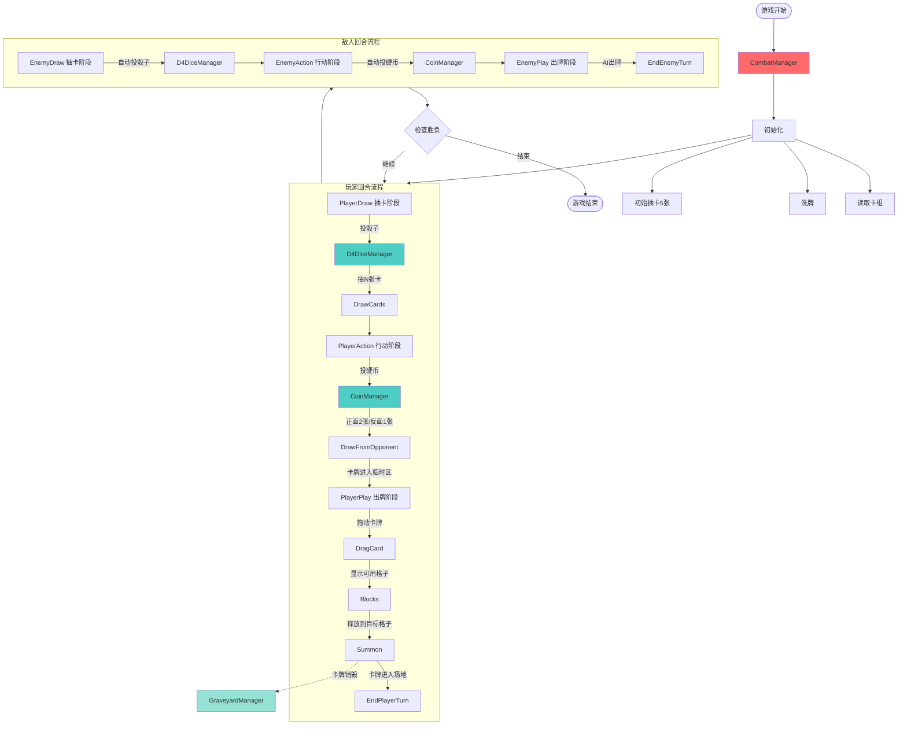
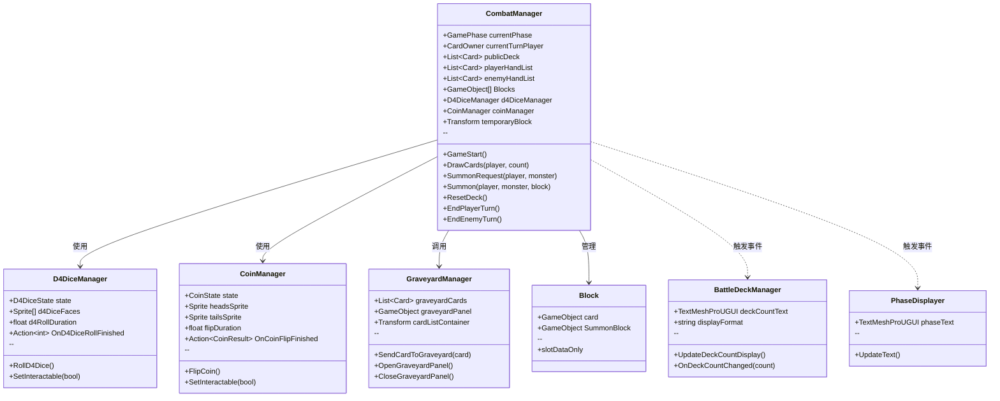
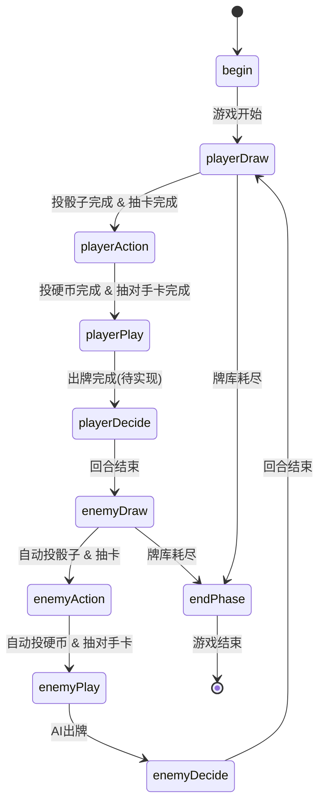
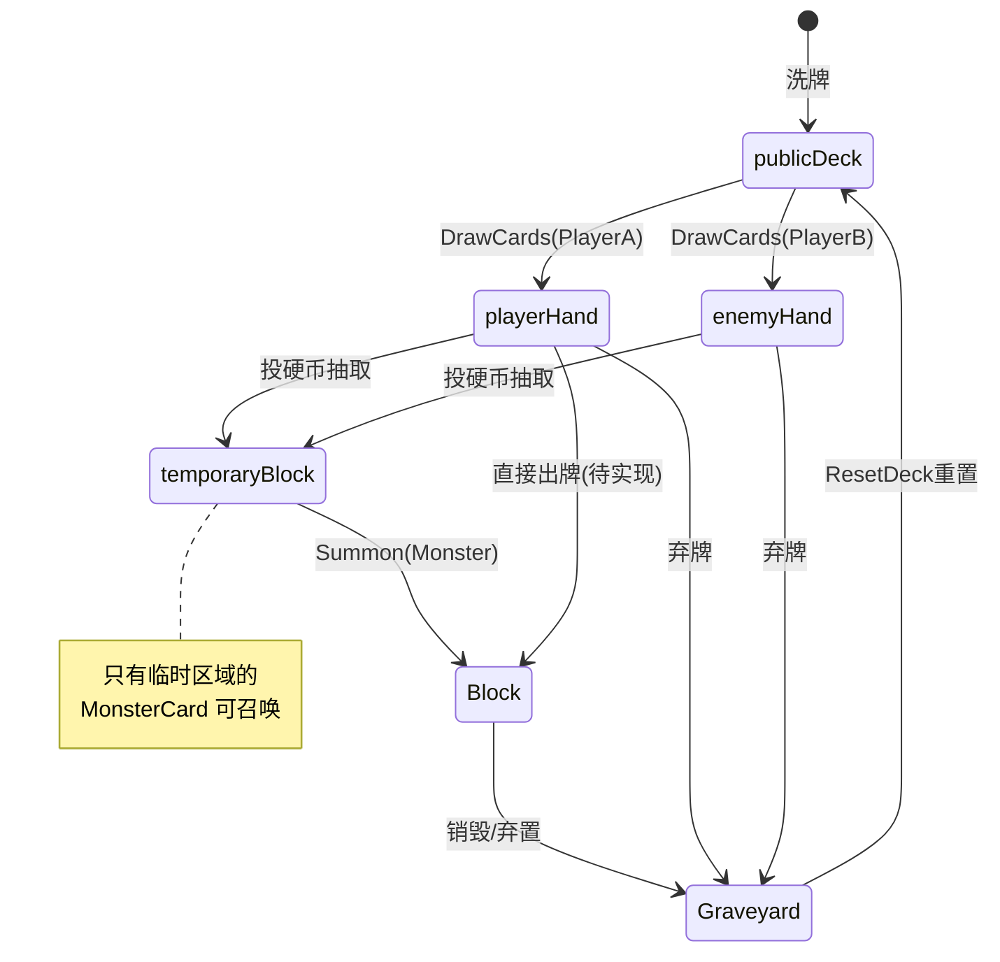
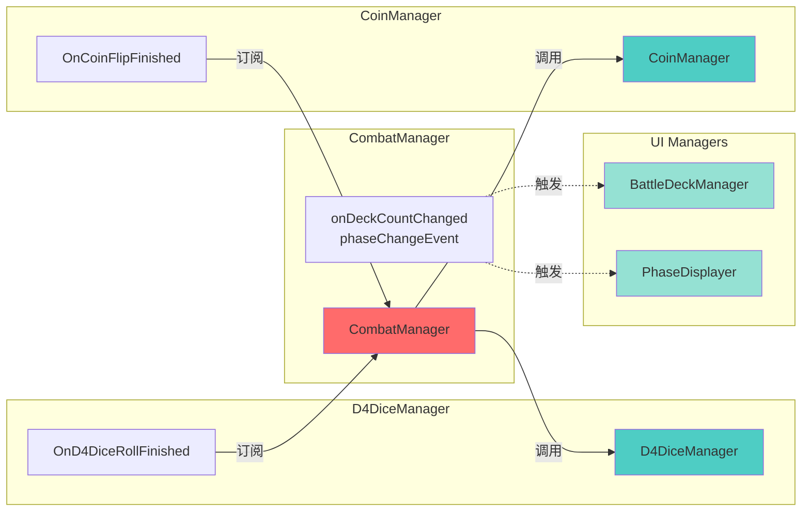
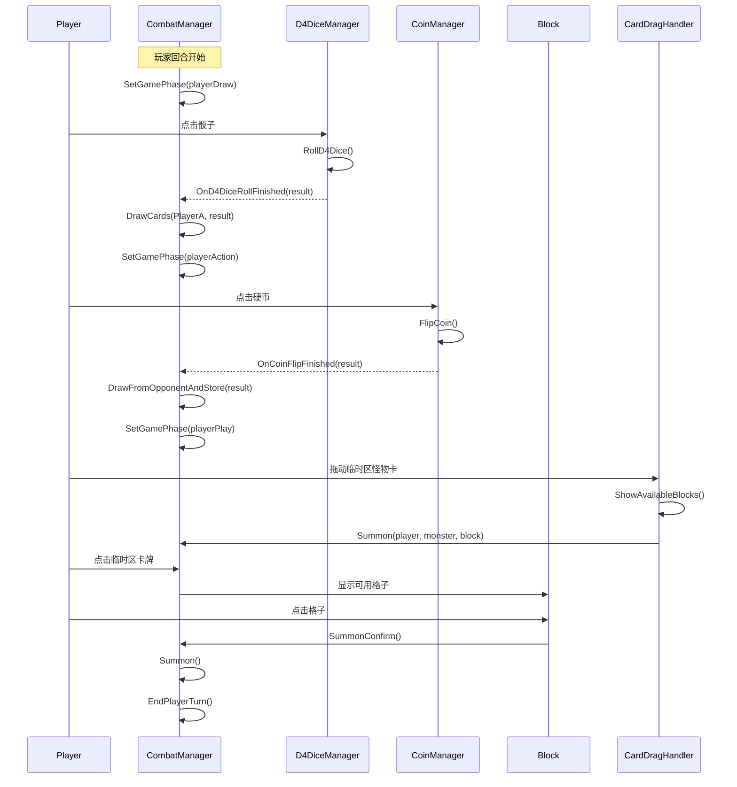
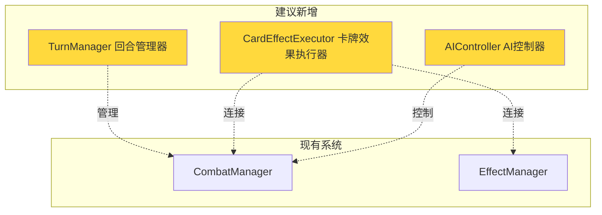

# BattleOrg 系统架构图

## 系统整体流程

## 管理器职责划分

## 回合阶段转换

## 卡牌状态流转

## 事件订阅关系

## 核心数据流

## 问题与改进建议

### 当前存在的问题

1. **回合管理耦合**
   - 回合逻辑全部在 `CombatManager` 中
   - 建议：抽取 `TurnManager`

2. **事件未正确触发**
   - `SetGamePhase()` 没有触发 `phaseChangeEvent`
   - 导致 `PhaseDisplayer` 无法自动更新

3. **阶段流转不完整**
   - `Update()` 只处理敌人回合
   - 玩家回合依赖手动触发

4. **卡牌效果未集成**
   - `Summon()` 时未调用效果系统
   - `EffectManager` 与战斗系统隔离

### 改进建议

